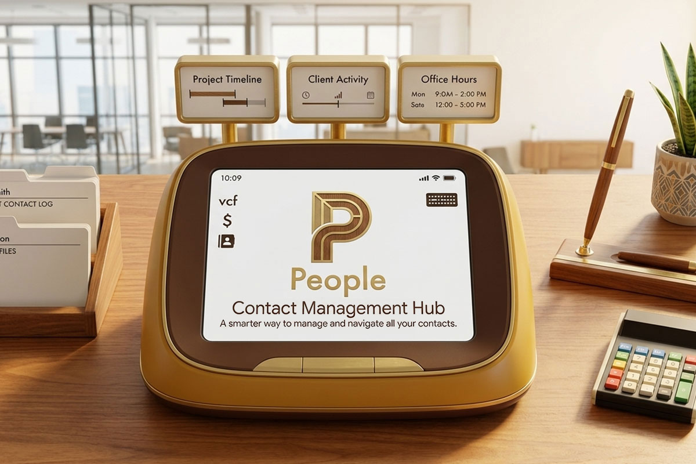

# People 📇

**まずは整理、同期は後で。すべての連絡先のためのスマートな中継ハブ。**

**People** は、ごちゃごちゃになりがちな名刺データやコミュニティの連絡先（ピックルボールのメンバーなど）を一時的にストック・整理するためのアプリです。

多機能な名刺管理ソフトによる「データのサイロ化（分断）」を否定し、会社やグループ単位で綺麗にクレンジング（整理）した上で、必要なデータだけを **vCard (.vcf) や CSV でエクスポートし、MacやiPhone、Windowsの標準アドレス帳へスムーズにパス（連携）する「中継ハブ（土管）」** として機能します。

## 哲学と特徴

### 1. 究極のデータ主権 (No SaaS, No Subscriptions)

あなたの連絡先データは、決して他社のサーバーに送信されません。月額の「家賃」も発生しません。
すべてはあなたのPCのローカル環境に `.people` ファイルとして保存されます。
**ソースコードはすべて公開（オープンソース）されており、外部への隠れた通信がないことを誰もが確認できます。**

### 2. サーバーレス・完全オフライン動作 (PWA)

PHPもデータベースサーバーも不要です。
一度ブラウザから「アプリとしてインストール」を行えば、Wi-Fiがないオフライン環境（カンファレンス会場や体育館など）でも、遅延ゼロで瞬時に起動・動作します。

### 3. File System Access API & 強固な暗号化による保護

OSのローカルにあるデータベースファイルをブラウザから直接読み書きします。
保存時には Web Crypto API を用いた `AES-256-GCM` による強力な暗号化が施されるため、万が一ファイルが流出してもパスワードがない限り絶対に解読されません。

- **🚨 警告:** パスワードを忘れた場合、暗号化の仕組み上、データの復元は技術的に100%不可能です。パスワードの管理には十分ご注意ください。
- **💡 推奨ブラウザ:** 直接の上書き保存（File System Access API）をフルサポートしている **Chrome** または **Edge** のご利用を強く推奨します（Safari/Firefoxでは毎回ダウンロード保存となります）。

### 4. OS標準アドレス帳と繋がる「中継ハブ」機能

People自身は最終的な住所録になることを目指していません。溜まったデータは、タグやグループで絞り込み、vCard (.vcf) 形式で一括エクスポートが可能です。出力されたファイルをダブルクリックするだけで、AppleやGoogle、Microsoftの標準連絡先にクリーンなデータが統合されます。

### 5. BYO-AI（Bring Your Own AI）アプローチ

「完全オフライン」の制約を守り抜くため、外部のAI APIとは直接通信しません。
未知の会計ソフトのCSVフォーマットに対応したい場合や、出力フォーマットをカスタマイズしたい場合は、内蔵のプロンプトをワンクリックでコピーし、普段お使いの ChatGPT や Claude に渡すだけ。AIが変換用のマッピングJSONを生成し、あらゆるシステムのハブとなる「AI持ち込み型」の柔軟なアーキテクチャを採用しています。

### 6. ブロックエディタのような入力体験

Excelのようなレガシーな表入力ではなく、「株式会社〇〇」や「土曜Pickleballチーム」といった親ブロックを作り、その中にメンバーを所属させていく直感的でシームレスなUXを提供します。

### 7. 柔軟な期間フィルターと高速なインクリメンタル検索

数千人のデータが溜まっても安心です。左側の目次からのインクリメンタル検索や、ハッシュタグによる動的なグループ分けを搭載。すべてのUIが再読み込みゼロで連動します。

### 8. 多重化されたローカル・オートセーブ（データ保護）

タイピング中の非同期ドラフト保存（IndexedDB）に加え、タブを閉じる瞬間の強制バックアップ機能により、万が一ブラウザがクラッシュしても直前の入力データを安全に復元します。

## 使い方

1. セキュリティの都合上、必ず **HTTPS環境**（GitHub Pages, Vercel等）またはローカルの `localhost` で `index.html` にアクセスしてください。
2. アドレスバーのアイコン、または画面のボタンから、PWAとして「アプリをインストール」します。
3. 以降はPCやスマートフォンのアプリケーションとして完全にオフラインで利用できます。

## ファイル構成

- `index.html` : UI本体
- `main.js` : アプリケーションロジック（Wasm SQLite制御、暗号化、vCard/CSV出力）
- `styles.css` : Tailwind CSSによって生成されたスタイル
- `sw.js` : PWA用の Service Worker（完全オフライン化、キャッシュ管理）
- `manifest.json` : PWAマニフェスト

## 開発の背景

名刺管理ソフトやコミュニティ管理アプリは、自社アプリ内にユーザーを囲い込もうとして多機能化し、結果として「このアプリを開かないとあの人の連絡先がわからない」というデータの分断（サイロ化）を引き起こしがちです。
Peopleはそれを否定し、「整理・統合して、OSの住所録にサッとパスする」ことに特化しています。この「土管」や「ハブ」としての役割は、ポータビリティを重んじるローカルファーストなアーキテクチャと完璧に合致します。

## 免責事項 (Disclaimer)

本ソフトウェアは「ローカルファースト」のアーキテクチャを採用しており、データはすべてお使いのPC（またはブラウザのIndexedDB）内に保存されます。
外部サーバーへの自動バックアップは行われないため、PCの故障、ブラウザのキャッシュクリア、予期せぬエラーなどによりデータが消失するリスクがあります。

**本ソフトウェアを使用したことによるデータの消失や、それによって生じた損害について、作者は一切の責任を負いません。**

日々の入力が完了した際は、こまめに保存（Cmd+S / Ctrl+S）を行い、出力された `.people` ファイルをGoogle DriveやDropboxなどの外部ストレージにバックアップ（退避）することを強く推奨します。

## ライセンス

MIT License
